# Шпаргалка по установке nginx, PHP 7, MySQL на Ubuntu 14.04

## Обновление пакетов
 
Приконнектимся к нашему серверу по SSH и обновим список пакетов:

```
sudo apt-get update
```

Установим текстовый редактор Vim, если еще не установлен:

```
sudo apt-get install vim
```

Некоторые полезные команды vim: 

```vim
Поиск в файле - </> stroka_poiska <Enter>
Включить режим добавления после курсора - кнопка a
Выход с сохранением  - <Esc> :wq <Enter>
Выход без сохранения  - <Esc> :q! <Enter>
Перейти на строку 50(например) - :50 <Enter>.
Удалить все строки в файле - :1,$d <Enter>
Если что-то пошло не так - проверить язык ввода. 
```

## Установка nginx


Установим последнюю версию nginx:

```
sudo apt-get install software-properties-common
sudo apt-get install python-software-properties
sudo add-apt-repository ppa:nginx/stable
sudo apt-get update
sudo apt-get install nginx
```


Проверим версию nginx:

```
sudo nginx -v
```

Результат:

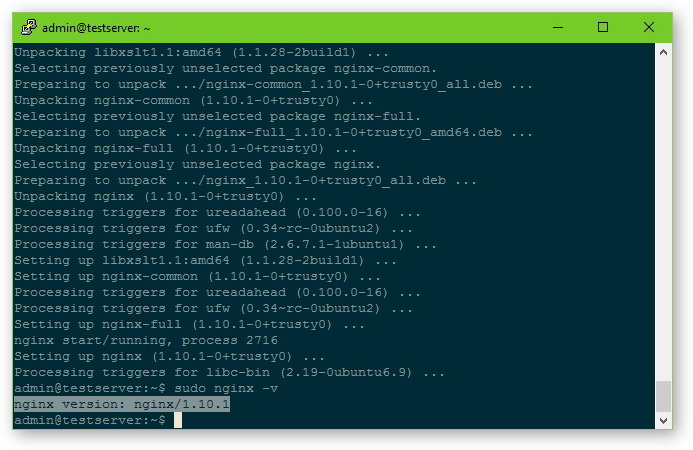

## Установка MySQL

Для начала скачаем MySQL APT репозиторий и выполним его конфигурацию:

```
wget http://dev.mysql.com/get/mysql-apt-config_0.6.0-1_all.deb
```
```
sudo dpkg -i mysql-apt-config_0.6.0-1_all.deb
```

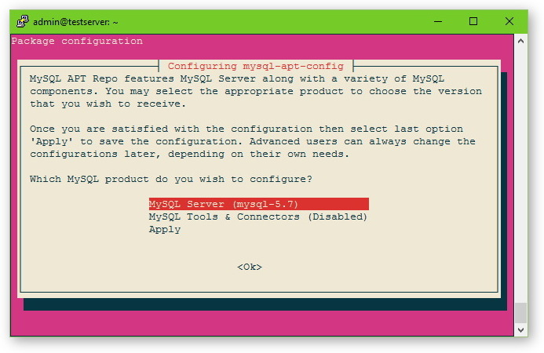
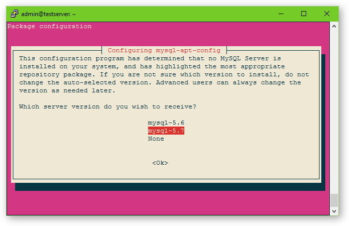
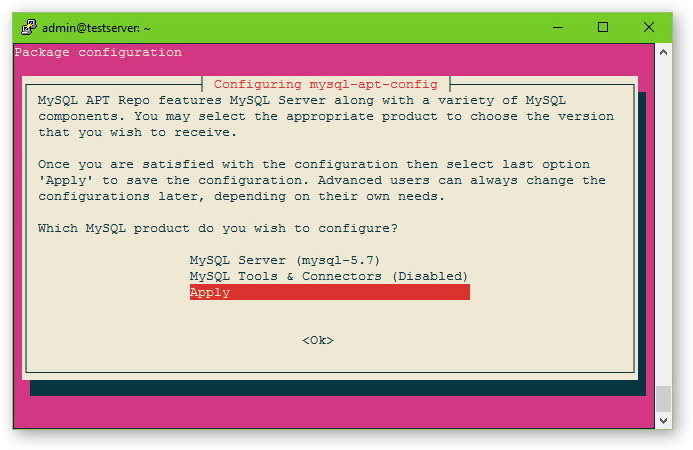


Установим MySQL 5.7:

```
sudo apt-get update
sudo apt-get install mysql-server
```

Во время установки нужно задать root пароль:

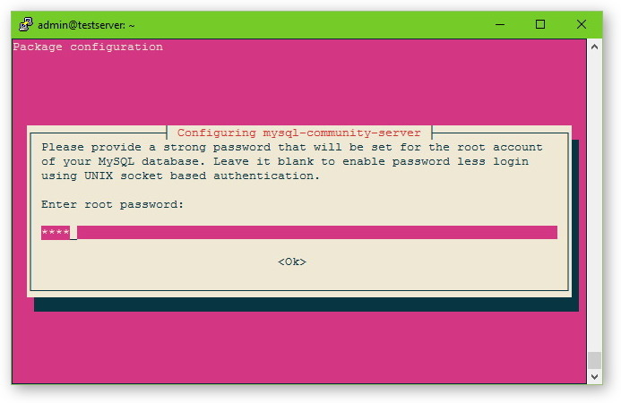

Проверим версию MySQL:

```
sudo mysql --version
```

Результат:

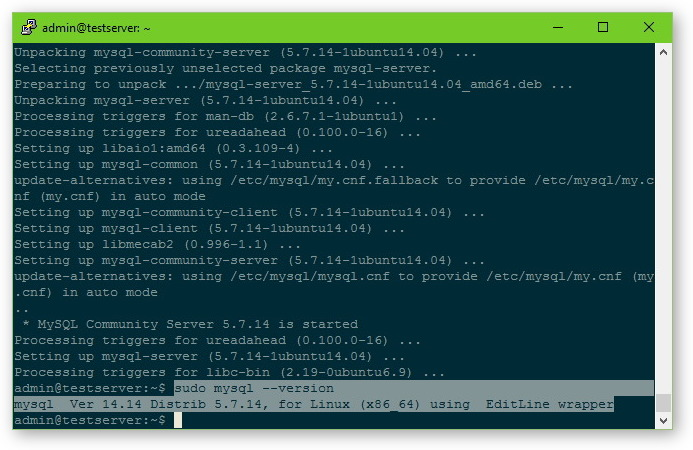


Изменим дефолтные настройки для повышения безопасности MySQL:

```
sudo mysql_secure_installation
```

Во время выполнения ответим на вопросы:

```
VALIDATE PASSWORD PLUGIN can be used to test passwords
and improve security. It checks the strength of password
and allows the users to set only those passwords which are
secure enough. Would you like to setup VALIDATE PASSWORD plugin?

Press y|Y for Yes, any other key for No: Y

There are three levels of password validation policy:
LOW    Length >= 8
MEDIUM Length >= 8, numeric, mixed case, and special characters
STRONG Length >= 8, numeric, mixed case, special characters and dictionary                  file

Please enter 0 = LOW, 1 = MEDIUM and 2 = STRONG: -- Выбрать любой вариант

Change the root password? -- No
Remove anonymous user? -- Yes
Disallow root login remotely? -- Yes
Remove test database and access to it? -- Yes
Reloade privilege tables now? -- Yes
```


Зайдем в консоль MySQL и проверим что всё работает:

```
mysql -u root -p
```
```sql
show databases;
quit
```

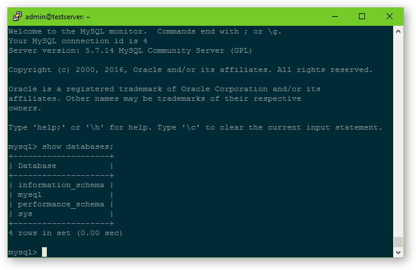


## Установка PHP 7


Для начала добавим репозиторий с PHP 7:

```
sudo add-apt-repository ppa:ondrej/php
sudo apt-get update
```

Установим связку PHP7-FPM для обработки динамических запросов (без apache2):

```
sudo apt-get install php7.0-fpm 
```

> Примечание: если выполнить комманду `sudo apt-get install php7.0`, то по умолчанию будет установлен apache2 c библиотеками для обработки php запросов.


Проверим версию PHP:

```
sudo php --version
```

Результат:

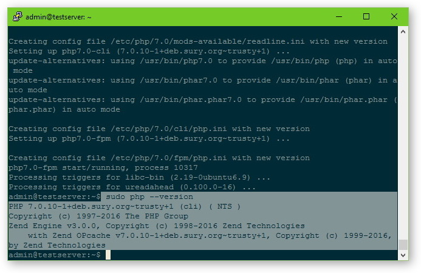

Установим нужные расширения для работы PHP с MySQL:

```
sudo apt-get install php7.0-mysql
```

Для безопасности нужно изменить строку в php.ini (файлы PHP 7 находятся в папке `/etc/php/7.0`):

```
sudo vim /etc/php/7.0/fpm/php.ini
```

Найдем строку `cgi.fix_pathinfo=` в файле:

```vim
</> cgi.fix_pathinfo= <Enter>
```

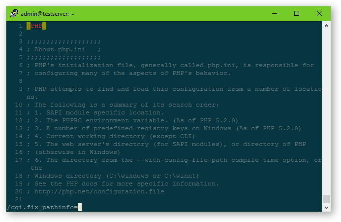

Примерно 760 строка, нужно раскоментировать и установить `cgi.fix_pathinfo=0`

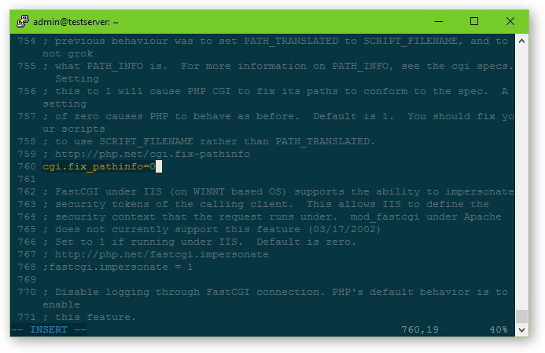

Сделаем рестарт PHP 7:

```
sudo service php7.0-fpm restart
```

nginx при установке создал сайт с приветствием, изменим дефолтный конфиг этого сайта для работы с PHP 7:

```
sudo vim /etc/nginx/sites-enabled/default
```


Очистим файл:

```vim
:1,$d <Enter>
```

Включим режим добавления:

```vim
a
```

И добавим туда простой конфиг:

```nginxconf
server {
        listen 80 default_server;
        listen [::]:80 default_server;

		#корневая директория где хранятся файлы сайта
        root /var/www/html; 

		#возможные имена индексных файлов
        index index.php index.html index.htm index.nginx-debian.html;

        server_name _;

        location / {
				try_files $uri $uri/ =404;
				
				#сначало проверяем существует ли файл из запроса $uri,
				#если нет, проверяем наличие директории $uri/ 
				#если и директория не существует, то показать ошибку 404
                
        }

        location ~ \.php$ {
				#перенаправление php запросов на обработку php7.0-fpm
				#для апгрейда с php5 на php7 нужно изменить строку:
				#/var/run/php5-fpm.sock на /var/run/php/php7.0-fpm.sock
				
                fastcgi_split_path_info ^(.+\.php)(/.+)$;
                fastcgi_pass unix:/var/run/php/php7.0-fpm.sock; 
                fastcgi_index index.php;
                fastcgi_param SCRIPT_FILENAME $document_root$fastcgi_script_name;
                include fastcgi_params;
        }
}
```

Сохраним файл:

```vim
<Esc> :wq <Enter>
```

Перезапустим nginx:	

```
sudo service nginx restart
```

Файлы сайта с приветствием лежат по адресу `/var/www/html`. Создадим в этой папке `phpinfo.php` для проверки работы PHP 7:

```
sudo vim /var/www/html/phpinfo.php
```

Добавим в файл:

```php
<?php
phpinfo();
```

Введем в браузере <ip_адресс_сервера>/phpinfo.php:

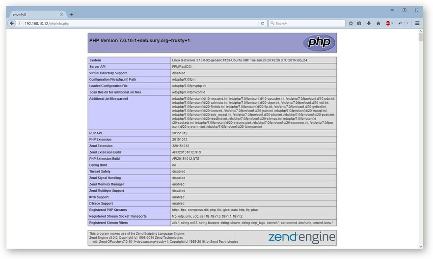

Удалим созданный файл phpinfo.php:

```
sudo rm /var/www/html/phpinfo.php
```

## Добавление нового сайта в nginx

Создадим директорию для нового сайта в папке `/var/www/`:

```
sudo mkdir -p /var/www/testsite.com/public_html
```
 
Создадим новый nginx конфиг:

```
sudo vim /etc/nginx/sites-available/testsite.com
```

Добавим туда:

```nginxconf
server {
	#перенаправление всех запросов с www.testsite.com на testsite.com
	listen 80;
	server_name  www.testsite.com;
	return       301 $scheme://testsite.com$request_uri;
}

server {
	listen 80;

	server_name testsite.com;
	
	#кодировка сайта
	charset utf-8;

	#запретим открывать наш сайт во фрейме
	add_header X-Frame-Options SAMEORIGIN;
	
	#блокировка веб сканеров
	if ( $http_user_agent ~* (nmap|nikto|wikto|sf|sqlmap|bsqlbf|w3af|acunetix|havij|appscan) ) {
		return 444;
	}

	#корневая директория где хранятся файлы сайта
	root /var/www/testsite.com/public_html; 

	#возможные имена индексных файлов
	index index.php index.html index.htm;
	
	#добавление слеша в конце урл
	rewrite ^([^.]*[^/])$ $1/ permanent;
	
    location / {
		try_files $uri $uri/ /index.php?$query_string;
		
		#такая конфигурация реализует паттерн "Front Controller", тоесть
		#все url запросы передаются на обработку в одну точку, в данном случае index.php
	}

	location ~ \.php$ {
		try_files $uri /index.php =404;
		
		#перенаправление php запросов на обработку php7.0-fpm
		#для апгрейда с php5 на php7 нужно изменить строку:
		#/var/run/php5-fpm.sock на /var/run/php/php7.0-fpm.sock
		
        fastcgi_split_path_info ^(.+\.php)(/.+)$;
        fastcgi_pass unix:/var/run/php/php7.0-fpm.sock; 
        fastcgi_index index.php;
        fastcgi_param SCRIPT_FILENAME $document_root$fastcgi_script_name;
        include fastcgi_params;
    }
	
	
    location = /favicon.ico { access_log off; log_not_found off; }
    location = /robots.txt  { allow all; access_log off; log_not_found off; }
	
	#запретить доступ к файлам начинающимся с .ht,
	#например .htaccess
	location ~ /\.ht {
		deny  all;
	}
	
	#выключить логи доступа
	access_log off;
	
	#указывает куда писать error логи
    error_log  /var/log/nginx/testsite.com-error.log error;

}

```

Сохраним файл:

```vim
<Esc> :wq <Enter>
```

Активируем новый хост nginx:

```
sudo ln -s /etc/nginx/sites-available/testsite.com /etc/nginx/sites-enabled/testsite.com
```

А также удалим дефолтный хост nginx чтобы не было конфликтов:

```
sudo rm /etc/nginx/sites-enabled/default  
```

Снова сделаем рестарт nginx:	

```
sudo service nginx restart
```

## Добавление пользователя в Ubuntu

Добавим нового юзера в Ubuntu:

```
sudo adduser testuser
```

> Важно: не забыть записать пароль нового юзера!

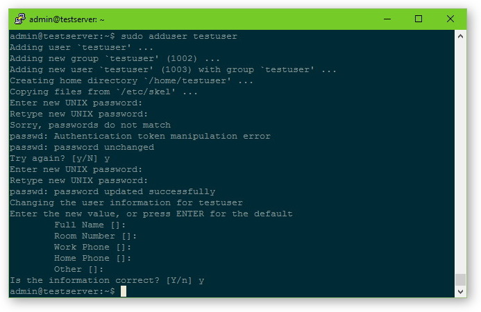

Дадим новому юзеру права на директорию с нашим сайтом, чтобы можно было загружать туда файлы по ftp:

```
sudo chown -R testuser /var/www/testsite.com
```

Проверим права:

```
ls -l /var/www/testsite.com
```

Результат:

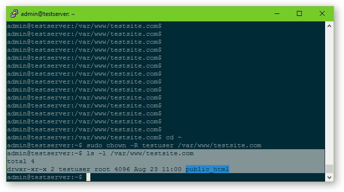

## Добавление пользователя в MySQL

Заходим в панель MySQL под root'ом и добавляем нового пользователя:

```
mysql -u root -p
```
```sql
CREATE USER 'test_user'@'localhost' IDENTIFIED BY 'myNewUserPass123';
```

>`test_user` - логин
>`localhost` - имя хоста
>`myNewUserPass123` - пароль

Создадим тестовую базу:
 
```sql
CREATE DATABASE test;
```

Дадим новому юзеру привилегии на тестовую базу:

```sql
GRANT ALL PRIVILEGES ON test.* TO 'test_user'@'localhost';
```

> `GRANT ALL PRIVILEGES ON *.*` - эта команда дает **все** права на **<имя_базы> . <имя_таблицы>**  

```sql
FLUSH PRIVILEGES;
```

Выходим из панели MySql:

```sql
quit
```
 
Проверим нового юзера:

```
mysql -u test_user -p
```

```sql
show databases;
```

```sql
quit
```

Результат:

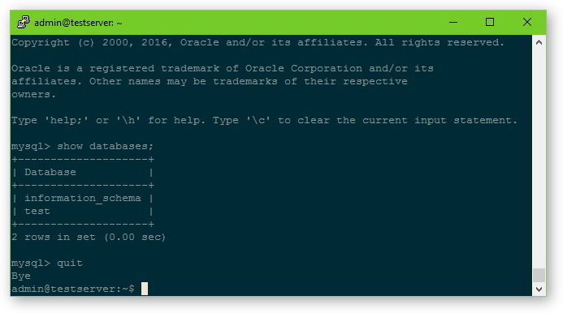
