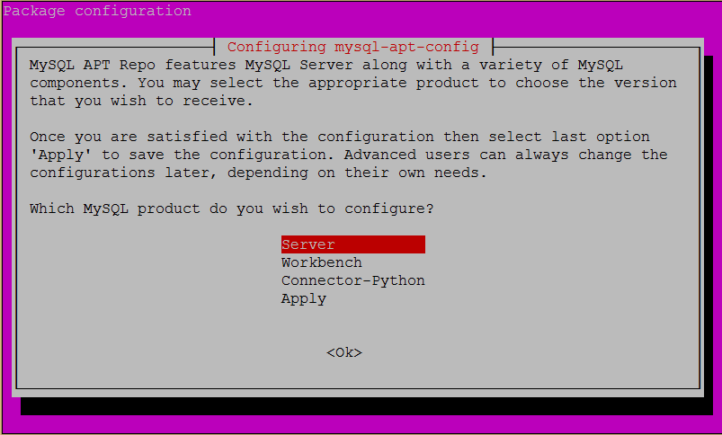
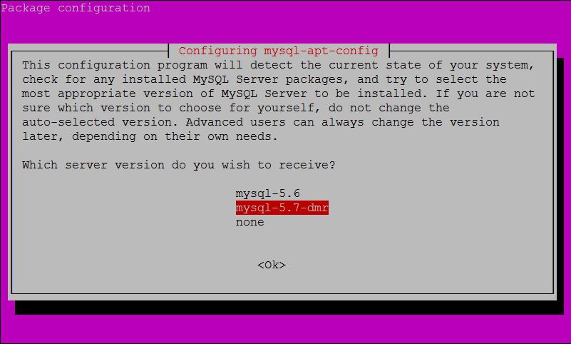
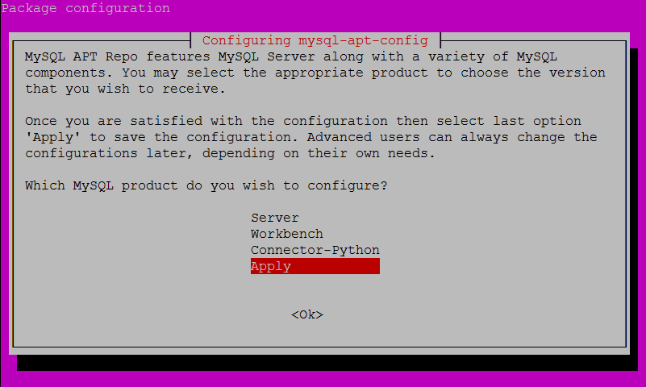
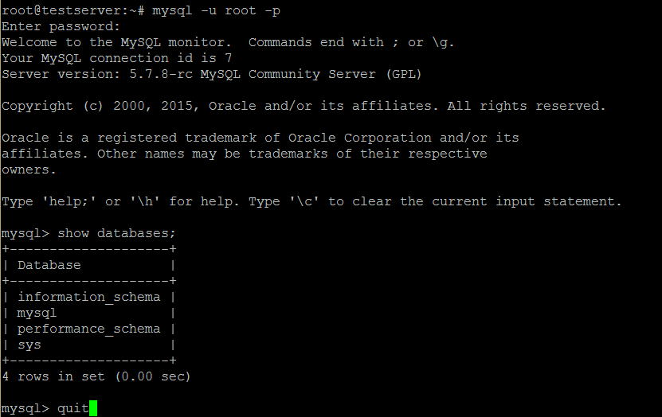
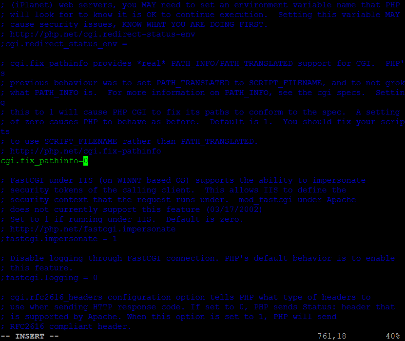
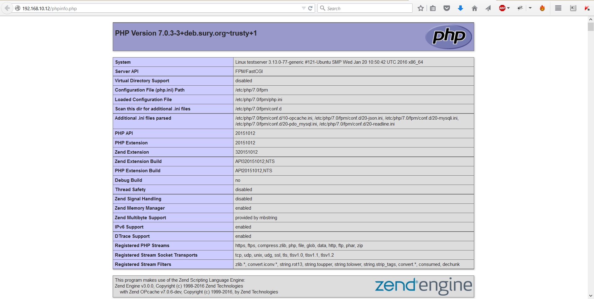
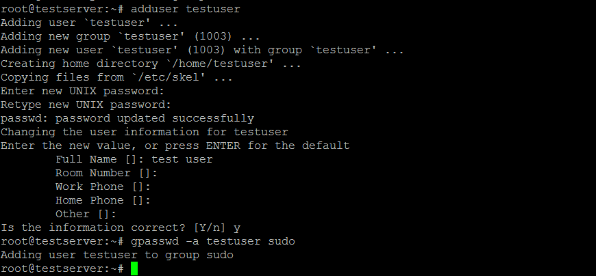
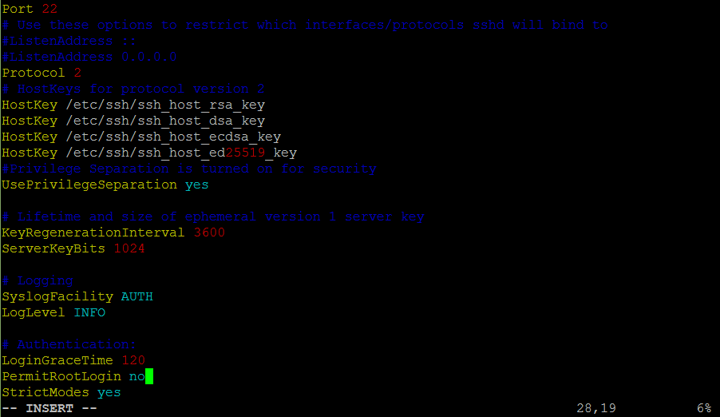
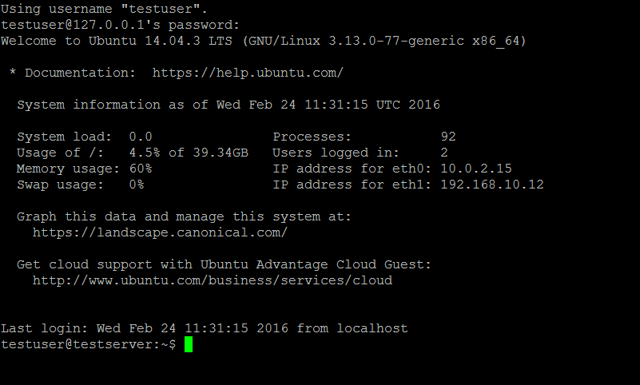

# Шпаргалка установке nginx, PHP 7, MySQL на Ubuntu 14.04

## Начало

#### Приконнектимся к нашему серверу по SSH и обновим список пакетов:

```shell
sudo apt-get update
```

#### Установим текстовый редактор Vim, если еще не установлен:

```shell
sudo apt-get install vim
```

#### Некоторые полезные команды vim: 

```vim
Включить режим добавления после курсора - кнопка a
Выход с сохранением  - <Esc> :wq <Enter>
Выход без сохранения  - <Esc> :q! <Enter>
Перейти на строку 50(например) - :50 <Enter>.
Удалить все строки в файле - :1,$d <Enter>
Если что-то пошло не так - проверить язык ввода. 
```

## Установка nginx.


#### Установим последнюю версию nginx:

```shell
sudo apt-get install python-software-properties
sudo add-apt-repository ppa:nginx/stable
sudo apt-get update
sudo apt-get install nginx
```


#### Проверим версию nginx:

```shell
sudo nginx -v
```
```shell
Результат:
root@testserver:~# sudo nginx -v
nginx version: nginx/1.8.1
```

## Установка MySQL 5.7.


#### Для начала скачаем MySQL APT репозиторий и выполним его конфигурацию:

```shell
wget http://dev.mysql.com/get/mysql-apt-config_0.3.2-1ubuntu14.04_all.deb
```
```shell
sudo dpkg -i mysql-apt-config_0.3.2-1ubuntu14.04_all.deb
```






#### Установим MySQL 5.7:

```shell
sudo apt-get update
sudo apt-get install mysql-server-5.7
```


#### Проверим версию MySQL:

```shell
sudo mysql --version
```
```shell
Результат:
root@testserver:~# sudo mysql --version
mysql  Ver 14.14 Distrib 5.7.8-rc, for Linux (x86_64) using  EditLine wrapper
```


#### Изменим дефолтные настройки для повышения безопасности MySQL:

```shell
sudo mysql_secure_installation
```

#### Во время выполнения ответим на вопросы:

```
VALIDATE PASSWORD PLUGIN can be used to test passwords
and improve security. It checks the strength of password
and allows the users to set only those passwords which are
secure enough. Would you like to setup VALIDATE PASSWORD plugin?

Press y|Y for Yes, any other key for No: Y

There are three levels of password validation policy:
LOW    Length >= 8
MEDIUM Length >= 8, numeric, mixed case, and special characters
STRONG Length >= 8, numeric, mixed case, special characters and dictionary                  file

Please enter 0 = LOW, 1 = MEDIUM and 2 = STRONG: -- Выбрать любой вариант

Change the root password? -- No
Remove anonymous user? -- Yes
Disallow root login remotely? -- Yes
Remove test database and access to it? -- Yes
Reloade privilege tables now? -- Yes
```


#### Зайдем в консоль MySQL и проверим что всё работает:

```shell
mysql -u root -p
```
```mysql
show databases;
quit
```




## Установка PHP 7.


#### Для начала добавим репозиторий с PHP 7:

```shell
sudo add-apt-repository ppa:ondrej/php
sudo apt-get update
```

#### Установим связку PHP7-FPM для обработки динамических запросов (без apache2):

```shell
sudo apt-get install php7.0-fpm 
```

> Примечание: если выполнить комманду `sudo apt-get install php7.0`, то по умолчанию будет установлен apache2 c библиотеками для обработки php запросов.


#### Проверим версию PHP:

```shell
sudo php --version
```
```
Ответ:
PHP 7.0.3-3+deb.sury.org~trusty+1 (cli) ( NTS )
Copyright (c) 1997-2016 The PHP Group
Zend Engine v3.0.0, Copyright (c) 1998-2016 Zend Technologies
	with Zend OPcache v7.0.6-dev, Copyright (c) 1999-2016, by Zend Technologies
```


#### Установим нужные расширения для работы PHP с MySQL:

```shell
sudo apt-get install php7.0-mysql
```


#### Для безопасности нужно изменить строку в php.ini (файлы PHP 7 находятся в папке /etc/php/7.0):

```shell
sudo vim /etc/php/7.0/fpm/php.ini
```

> Примерно 760 строка, нужно раскоментировать и установить `cgi.fix_pathinfo=0`




#### Перезапустим PHP 7:

```shell
sudo service php7.0-fpm restart
```


#### nginx при установке создал сайт с приветствием, изменим дефолтный конфиг этого сайта для работы с PHP 7:

```shell
sudo vim /etc/nginx/sites-enabled/default
```


#### Очистим файл:

```vim
:1,$d <Enter>
```

#### Включим режим добавления:

```vim
a
```

#### И добавим туда простой конфиг:

```nginx
server {
        listen 80 default_server;
        listen [::]:80 default_server;

		#корневая директория где хранятся файлы сайта
        root /var/www/html; 

		#возможные имена индексных файлов
        index index.php index.html index.htm index.nginx-debian.html;

        server_name _;

        location / {
				try_files $uri $uri/ =404;
				
				#сначало проверяем существует ли файл из запроса $uri,
				#если нет, проверяем наличие директории $uri/ 
				#если и директория не существует, то показать ошибку 404
                
        }

        location ~ \.php$ {
				#перенаправление php запросов на обработку php7.0-fpm
				#для апгрейда с php5 на php7 нужно изменить строку:
				#/var/run/php5-fpm.sock на /var/run/php/php7.0-fpm.sock
				
                fastcgi_split_path_info ^(.+\.php)(/.+)$;
                fastcgi_pass unix:/var/run/php/php7.0-fpm.sock; 
                fastcgi_index index.php;
                fastcgi_param SCRIPT_FILENAME $document_root$fastcgi_script_name;
                include fastcgi_params;
        }
}
```

#### Сохраним файл:

```vim
<Esc> :wq <Enter>
```

#### Перезапустим nginx:	

```shell
sudo service nginx restart
```

#### Файлы сайта с приветствием лежат по адресу `/var/www/html`. Создадим в этой папке `phpinfo.php` для проверки работы PHP 7:

```shell
sudo vim /var/www/html/phpinfo.php
```

#### Добавим в файл:

```php
<?php
phpinfo();
```

#### Введем в браузере <ip_адресс_сервера>/phpinfo.php:




#### Удалим созданный файл phpinfo.php:

```shell
sudo rm /var/www/html/phpinfo.php
```


## Добавление нового сайта.

#### Создадим директорию для нового сайта в папке `/var/www/`:

```shell
sudo mkdir -p /var/www/testsite.com/public_html
```
 
#### Создадим новый nginx конфиг:

```shell
sudo vim /etc/nginx/sites-available/testsite.com
```

#### Добавим туда:

```nginx
server {
	#перенаправление всех запросов с www.testsite.com на testsite.com
	listen 80;
	server_name  www.testsite.com;
	return       301 $scheme://testsite.com$request_uri;
}

server {
	listen 80;

	server_name testsite.com;
	
	#кодировка сайта
	charset utf-8;

	#запретим открывать наш сайт во фрейме
	add_header X-Frame-Options SAMEORIGIN;
	
	#блокировка веб сканеров
	if ( $http_user_agent ~* (nmap|nikto|wikto|sf|sqlmap|bsqlbf|w3af|acunetix|havij|appscan) ) {
		return 444;
	}

	#корневая директория где хранятся файлы сайта
	root /var/www/testsite.com/public_html; 

	#возможные имена индексных файлов
	index index.php index.html index.htm;
	
	#добавление слеша в конце урл
	rewrite ^([^.]*[^/])$ $1/ permanent;
	
    location / {
		try_files $uri $uri/ /index.php?$query_string;
		
		#такая конфигурация реализует паттерн "Front Controller", тоесть
		#все url запросы передаются на обработку в одну точку, в данном случае index.php
	}

	location ~ \.php$ {
		try_files $uri /index.php =404;
		
		#перенаправление php запросов на обработку php7.0-fpm
		#для апгрейда с php5 на php7 нужно изменить строку:
		#/var/run/php5-fpm.sock на /var/run/php/php7.0-fpm.sock
		
        fastcgi_split_path_info ^(.+\.php)(/.+)$;
        fastcgi_pass unix:/var/run/php/php7.0-fpm.sock; 
        fastcgi_index index.php;
        fastcgi_param SCRIPT_FILENAME $document_root$fastcgi_script_name;
        include fastcgi_params;
    }
	
	
    location = /favicon.ico { access_log off; log_not_found off; }
    location = /robots.txt  { allow all; access_log off; log_not_found off; }
	
	#запретить доступ к файлам начинающимся с .ht,
	#например .htaccess
	location ~ /\.ht {
		deny  all;
	}
	
	#выключить логи доступа
	access_log off;
	
	#указывает куда писать error логи
    error_log  /var/log/nginx/testsite.com-error.log error;

}

```

#### Сохраним файл:

```vim
<Esc> :wq <Enter>
```

#### Активируем новый хост nginx:

```shell
sudo ln -s /etc/nginx/sites-available/testsite.com /etc/nginx/sites-enabled/testsite.com
```

#### А также удалим дефолтный хост nginx чтобы не было конфликтов:

```shell
sudo rm /etc/nginx/sites-enabled/default  
```

#### Перезапустим nginx:	

```shell
sudo service nginx restart
```

## Добавление пользователей в Ubuntu и MySQL

#### Добавим нового юзера для Ubuntu:

```shell
sudo adduser testuser
```

> Важно: не забыть записать пароль нового юзера!

#### Добавим нового юзера в группу sudo:

```shell
sudo gpasswd -a testuser sudo
```




#### Дадим новому юзеру права на директорию с нашим сайтом, чтобы можно было загружать туда файлы по ftp:

```shell
sudo chown -R testuser /var/www/testsite.com/public_html
```

#### Добавим нового юзера для MySQL:

```shell
mysql -u root -p
```
```mysql
CREATE USER 'newsqluser'@'localhost' IDENTIFIED BY 'myNewUserPass123';
```

#### Дадим новому юзеру привилегий:

```mysql
GRANT ALL PRIVILEGES ON * . * TO 'newsqluser'@'localhost';
```
```mysql
FLUSH PRIVILEGES;
```
```mysql
quit
```

#### Проверим нового юзера:

```shell
mysql -u newsqluser -p
```
```mysql
show databases;
```
```mysql
quit
```

## Запрет root доступа по SSH

> Важно: прежде чем отключить root доступ, нужно создать нового пользователя и записать его пароль.

#### Для безопасности отключим SSH доступ для root'a:

```shell
sudo vim /etc/ssh/sshd_config
```

#### Изменим строку 28: `PermitRootLogin no`



#### Сохраним файл и сделаем рестарт SSH:

```shell
sudo service ssh restart
```

#### Залогинимся и проверим нового юзера:

```shell
ssh testuser@<ip_адресс_сервера>
```

```shell
Ответить yes на вопрос и ввести пароль.
root@testserver:~$ ssh testuser@127.0.0.1
The authenticity of host '127.0.0.1 (127.0.0.1)' can't be established.
ECDSA key fingerprint is d3:b5:ba:7c:d5:80:fd:f9:d9:16:0d:b0:64:80:12:23.
Are you sure you want to continue connecting (yes/no)? yes
```




#### Конец