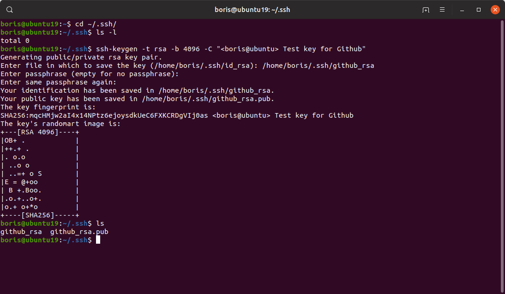
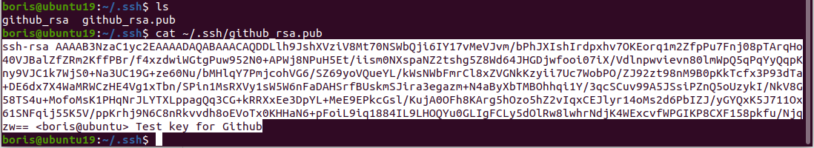
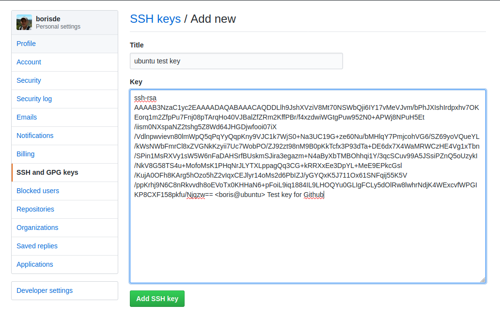
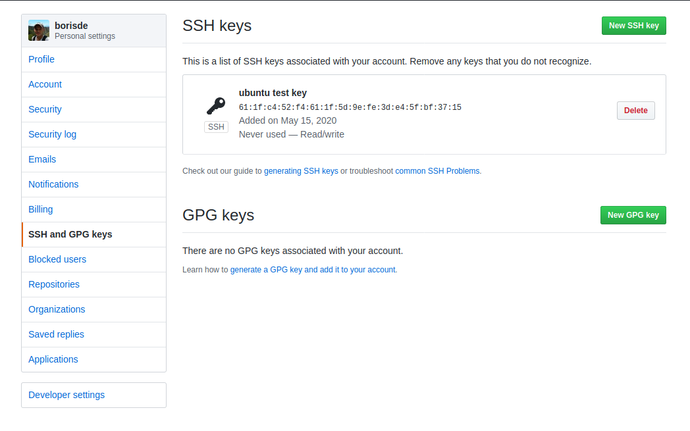

#Создание SSH ключей (Windows/Ubuntu). Добавление на Github.

### Создание SSH ключей под Ubuntu.

1. Заходим в ssh директорию  

    ```
    cd ~/.ssh/
   ```
   
2. Генерируем ключ:  

    ```
    ssh-keygen -t rsa -b 4096 -C "<boris@ubuntu> Test key for Github"
   ```    
   
3. Указываем любое имя файла (по умолчанию id_rsa):  

    ```
    github_rsa
   ```
   
4. Можно защитить паролем сразу или позже командой ```ssh-keygen -p```
    
     

5. Запускаем ssh-agent командой  

   ```
   eval "$(ssh-agent -s)"
   ```
   
6. Добавляем **приватный ключ** в ssh агент  

   ```
   ssh-add ~/.ssh/github_rsa
   ```
   
7. Проверяем командой  

   ```
   ssh-add -l
   ```    
   
   

8. Выводим наш **публичный ключ** командой: 
 
   ```
   cat github_rsa.pub
   ```  
   
   копируем его (без пробелов в конце!)
   
     

9. Идем на ```Github.com > settings > keys```, нажимаем кнопку ```New SSH Key``` и добавляем наш ключ:
    
       
    
      
   
10. Проверяем ssh подключение  
   ```
   ssh -T git@github.com
   ```  
   
    Результат:
      ```bash
      boris@ubuntu19:~/.ssh$ ssh -T git@github.com
      The authenticity of host 'github.com (140.82.118.3)' can't be established.
      RSA key fingerprint is SHA256:nThbg6kXUpJWGl7E1IGOCspRomTxdCARLviKw6E5SY8.
      Are you sure you want to continue connecting (yes/no)? нуы
      Please type 'yes' or 'no': yes
      Warning: Permanently added 'github.com,140.82.118.3' (RSA) to the list of known hosts.
      Hi borisde! You've successfully authenticated, but GitHub does not provide shell access.
      boris@ubuntu19:~/.ssh$
      ```   


> Если ключи создавались без использования команды ```sudo```, то и выполнять команды ```git``` нужно без ```sudo```. Например, если ввести ```sudo git clone```, то будут использованы ключи отличные от ранее созданных, получим ```Permission denied```