# Установка Vagrant на Windows 10

## Установка VirtualBox и Vagrant
 
Скачиваем и устанавливаем VirtualBox для Windows - [https://www.virtualbox.org/wiki/Downloads](https://www.virtualbox.org/wiki/Downloads)

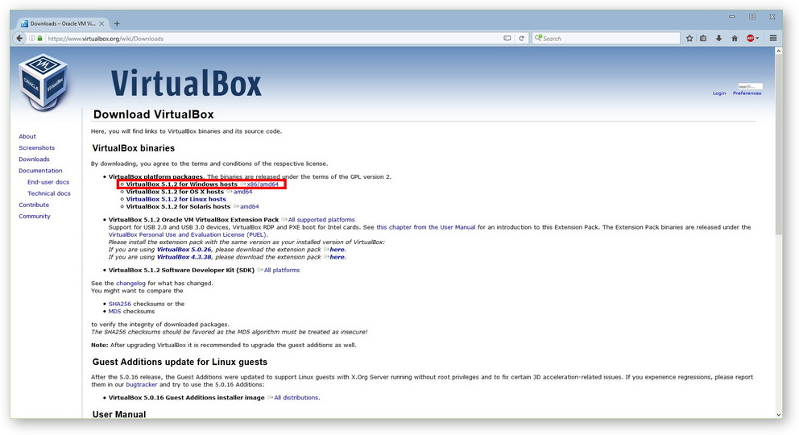

Скачиваем и устанавливаем Vagrant - [https://www.vagrantup.com/downloads.html](https://www.vagrantup.com/downloads.html)

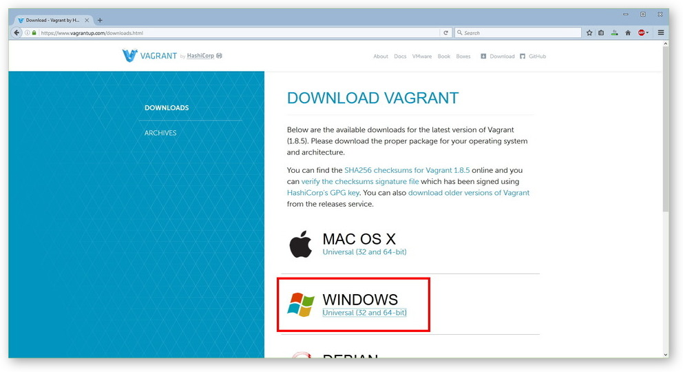

Проверим установку в командной строке Windows:

```
vagrant -v
```

Результат:

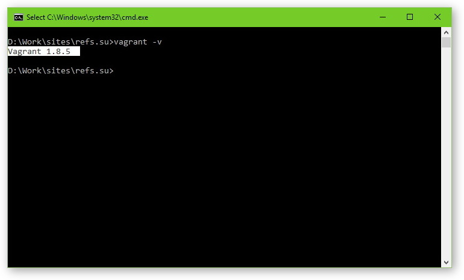

## Начало работы с Vagrant

Создадим директорию для нашего тестового проекта и зайдем в неё:
 
```
mkdir vagrant_test
cd vagrant_test
```

Начинаем новый проект:

```
vagrant init
```

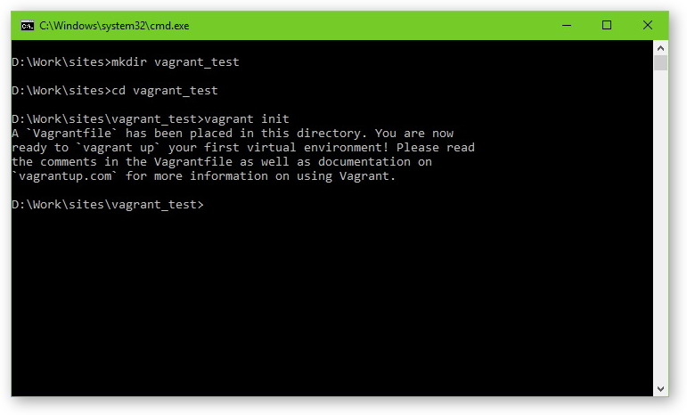

Команда `vagrant init` создает Vagrantfile который обозначает root директорию нашего проекта и описывает конфигурацию виртуальной машины:
 
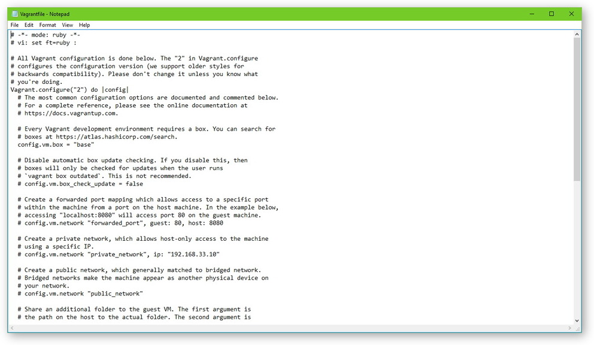 

Открываем Vagrantfile в текстовом редакторе, удаляем дефолтные настройки и добавляем следующий конфиг:

```sh
Vagrant.configure(2) do |config|

  # Vagrant box - образ ОС из которой
  # будет создана виртуальная машина.
  # Список образов на https://app.vagrantup.com/boxes/search
  # Здесь используется Ubuntu Server 14.04 LTS
  config.vm.box = "ubuntu/trusty64"
  

  # Отключает автоматическое обновление образов.
  config.vm.box_check_update = false
  

  # Создает приватную сеть 
  # с доступом только из хоста и
  # присваивает виртуальной машине IP.
  config.vm.network "private_network", ip: "192.168.10.111"
  

  # Директории которые будут синхронизироваться
  # между локальным компьютером и виртуалкой.
  config.vm.synced_folder "D:/Work/sites/vagrant_test", "/var/www/vagrant_test"
  

  # Настройки виртуальной машины
  config.vm.provider "virtualbox" do |vb|
	 # Показывать или нет интерфейс VirtualBox при загрузке.
	 vb.gui = false
	 # Выделяемая память для виртуалки.
	 vb.memory = "1024"
	 # Название в интерфейсе VirtualBox.
	 vb.name = "vagrant_test"
  end  

end
```

## Запуск Vagrant

После настройки Vagrantfile можно запускать виртуальную машину выполнив команду:

```
vagrant up
```

Vagrant скачает образ `ubuntu/trusty64` который мы указали в конфиге и на его основе создаст и запустит виртуальную машину с нашей конфигурацией.


По умолчанию скачанные образы хранятся в `C:\Users\<user_name>\.vagrant.d\boxes`.

## Доступ к Vagrant по SSH

Теперь когда виртуальная машина создана и запущена можно приконектиться к Vagrant по SSH. Я использую PuTTY.

Дефолтный адрес `127.0.0.1:2222` или можно использовать ip, которое мы указали в Vagrantfile - `192.168.10.111:22`

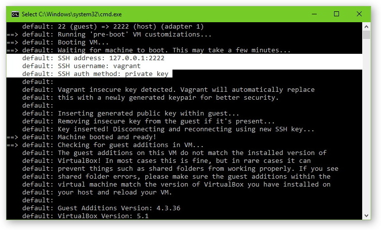

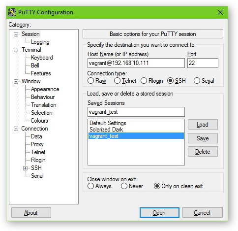

Логин и пароль по умолчанию `vagrant` и `vagrant`.

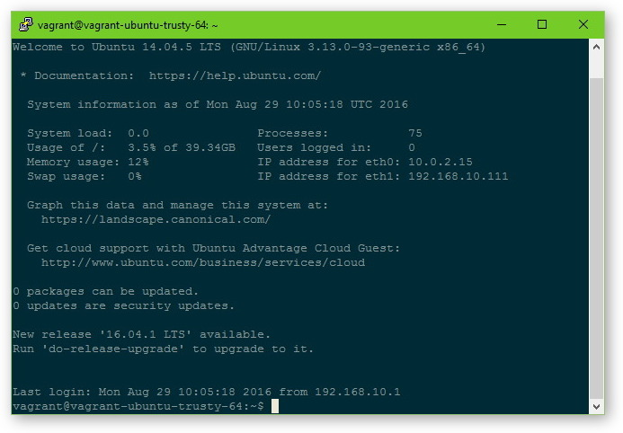

Проверим синхронизацию директорий между хостом и виртуалкой.

Создадим в директории проекта папку `public` с файлом `test.html`

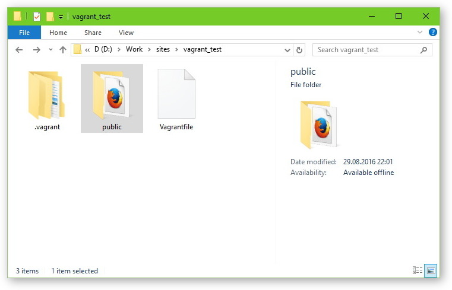

Проверим в в виртуалке:

```
cd /var/www/vagrant_test/public
ls
```

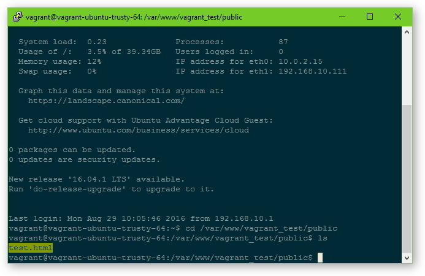

## Список команд Vagrant

```sh
# Запуск виртуальной машины
vagrant up
# Выключает машину
vagrant halt
# Перезапуск машины
vagrant reload
# Запускает заново скрипт конфигурации виртуальной машины
# Нужно выполнять при изменении файла конфигурации
vagrant provision
# Удаление файлов виртуалки
vagrant destroy
```

> Полный список Vagrant команд - [https://www.vagrantup.com/docs/cli/](https://www.vagrantup.com/docs/cli/)

## Изменение папки виртуальных машин в VirtualBox

По умолчанию VirtualBox создает новые виртуальные машины в директории `C:\Users\<user_name>\.VirtualBox`

Можно назначить другую папку, для этого нужно выбрать: `Файл -> Настройки -> Папка для машин по умолчанию`

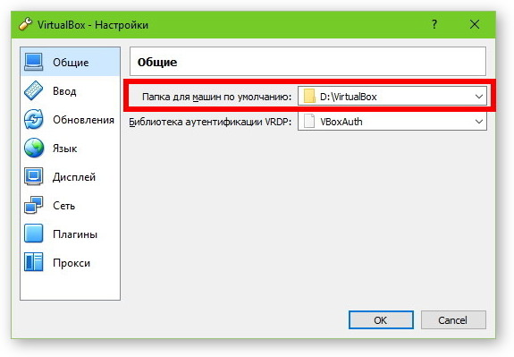

## Перенос файлов виртуальной машины на другой диск

Иногда требуется перенести файлы виртуальной машины на другой диск или в другую директорию. Для этого нужно выполниь следующие действия:

Остановим Vagrant, если он запущен 

```
vagrant halt
```

Запустим VirtualBox:
 
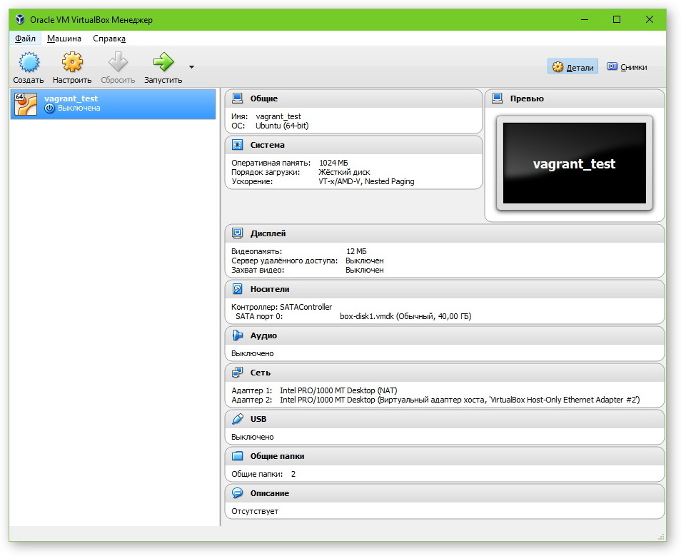

Выбираем `Файл` -> `Менеджер виртуальных носителей`.
 
Выбрать из списка наш диск и нажать кнопку `Освободить`

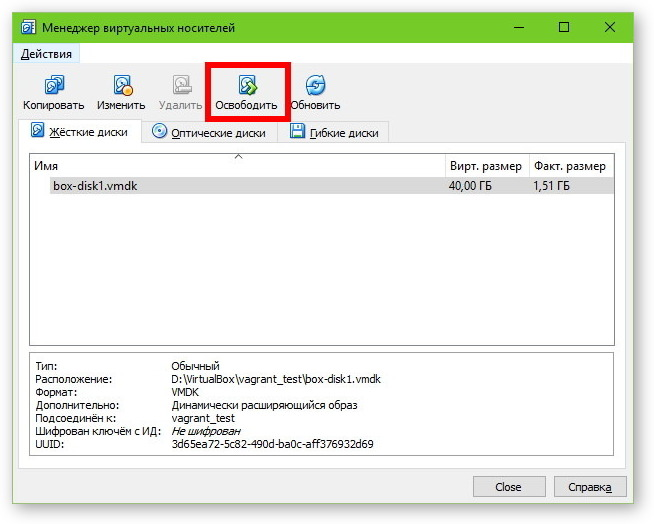

После этого там же нажать кнопку `Удалить`
 
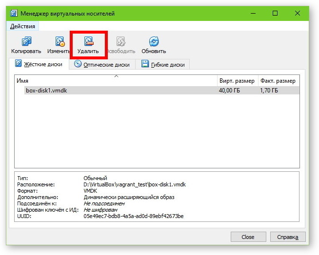 

Нажать кнопку `Убрать` и выбрать `Сохранить`

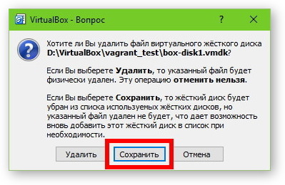

**Теперь нужно обязательно закрыть окно VirtualBox'а.**

После этого можно перемещать файлы нашей виртуалки из дефолтной папки VirtualBox'a.
 
Я перенесу например в `C:\vagrant_test`.

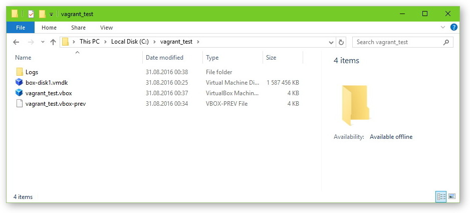

Дальше нужно подключить наш перемещенный диск обратно в VirtualBox. Для этого:

Открываем в текстовом редакторе файл `C:\Users\<user_name>\.VirtualBox\VirtualBox.xml` и находим в нём строку где прописан старый путь к Vagrant боксу:
 
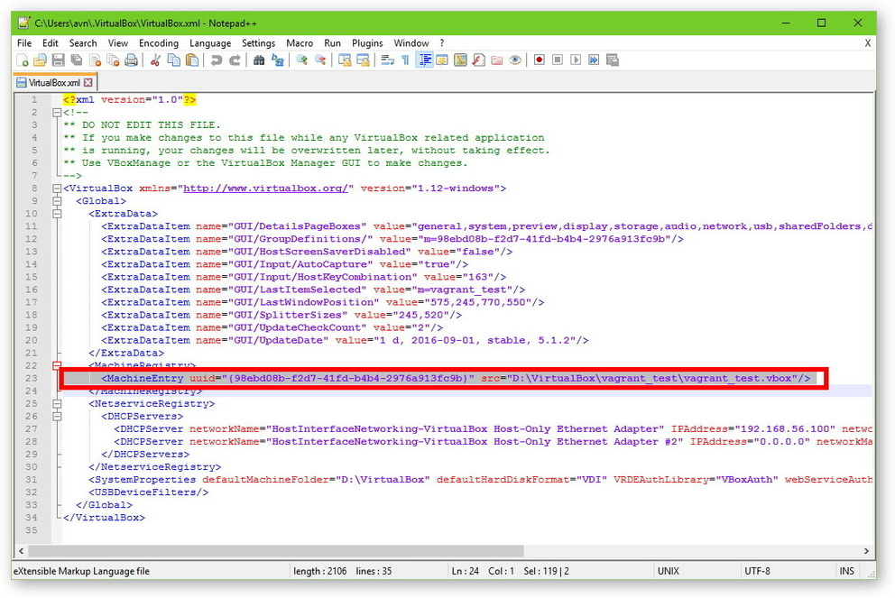

Указываем в этой строке новое расположение файла:
  
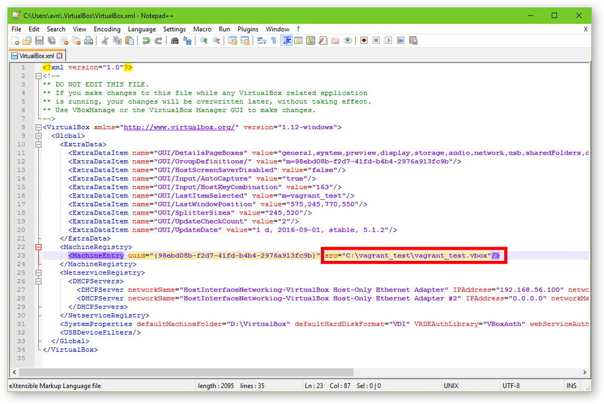

Сохраняем и закрываем файл.

Вновь запускаем VirtualBox, правый клик на нашей виртуалке -> `Настроить` -> `Носители` -> `Добавить жесткий диск`

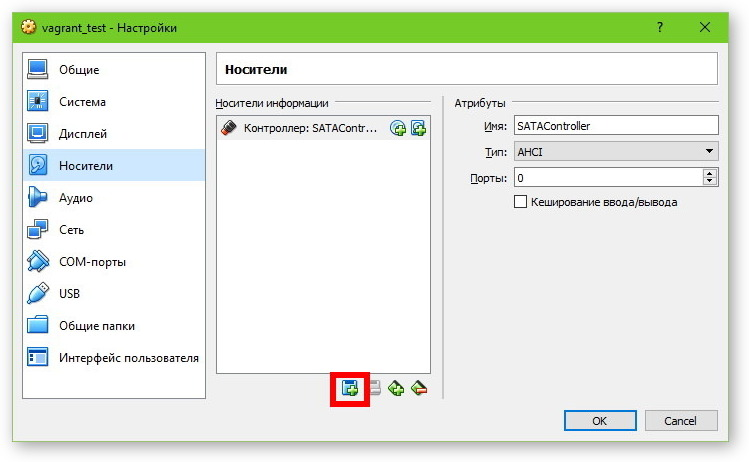

Нажать `Выбрать существующий диск` из папки в которую мы его перенесли:

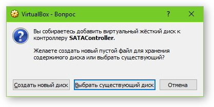

Завершить нажав `Ok`, перейти в папку с проектом Vagrant и проверить перенос выполнив команду:

```
vagrant up
```
